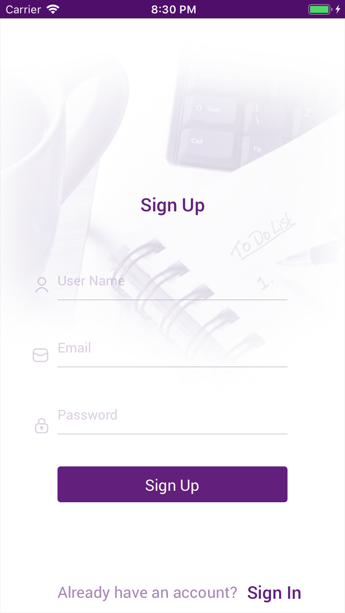
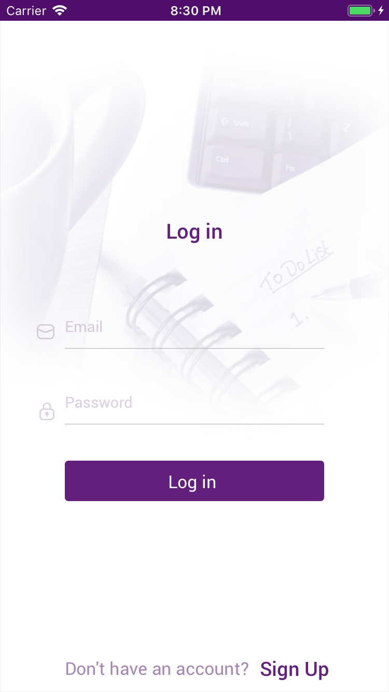
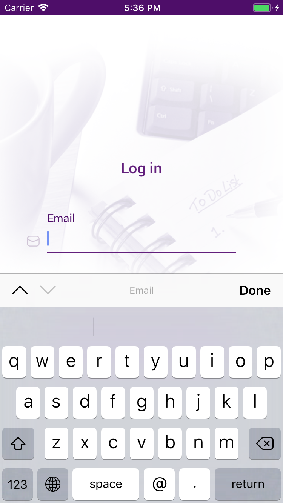
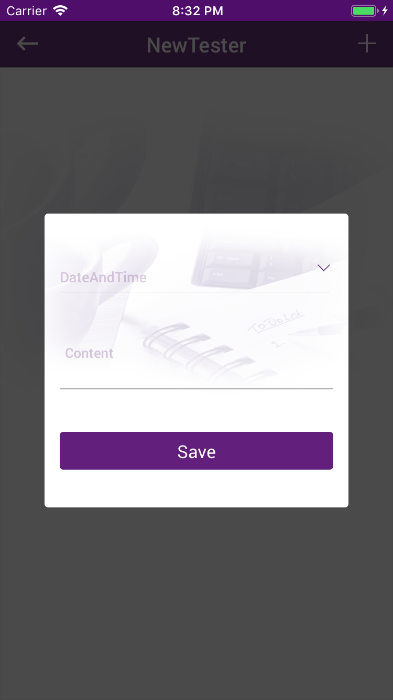
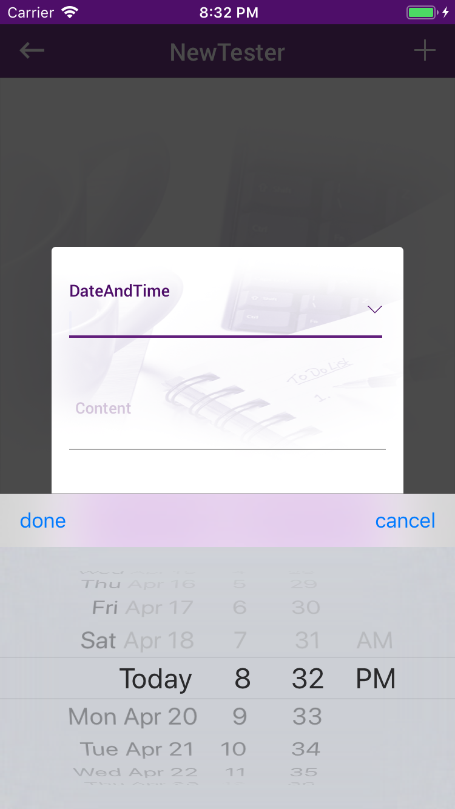
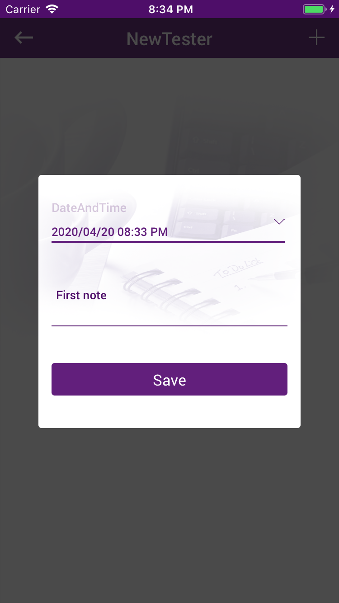
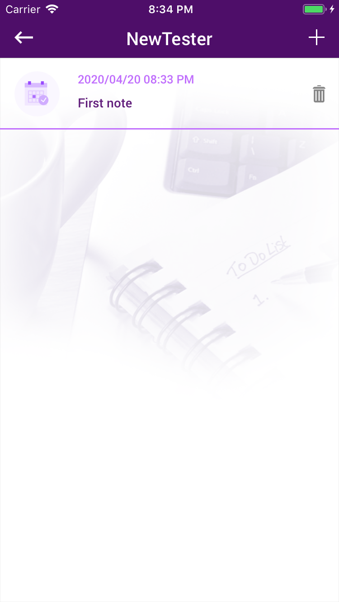

# To-Do-List
An application to track of daily obligations with date and time using google firebase database to store the
user data and the list of tasks.
It is about 4 Views.

# 1- SignUp View
It contains user name, user email and password. 
 When the user clicks on Sign Up button 
- In case he/she entered invalid data he/she should see an alert tell him/her what is wrong. 
- In case he/she entered valid data you	must save his/her credentials to a Firebase Database and if the process succeeded he/she should	go to main screen. Otherwise an	alert must be shown with the error. 

  
 

# 2- SignIn View
It contains user email and password. 
- In case the user already has an account and he/she try to log in via Sign In screen you must validate email and password. 
- In case he/she entered invalid data he/she should see an alert tell him/her what is wrong. 
- In case he/she entered valid data you must check if these credentials exist on database or not to decide to let him/her in or alert him/her with invalid credentials alert. 
  
 | 
# 3-User List View
It contains: 
1- Backarrow: to get back to signin view to log in with different user. 
2- Plus : to add note (Contetct with it's date and time) 
When the user clicks on + button the user will see the popup view.
  

# 4-PopUP View (Note Details)
It contains: 
1- Date and time textfield by user dateAndTime Picker. 
2- content textfield to add whatever the user wants to add. 
3- Save Button:  
  When the user clicks on Save button 
- In case he/she entered date, time and content you must dismiss the popup and add the todo. 
- Otherwise you must show an alert to tell him/her what is the the missed data and ask him/her to enter it.
  
 |  |   
After adding the note and press save the user list view will show then the note will be added to the view and stored in the firebase database.
  
 
In case the user wants to delete any note there is a delete icon for each added note to delete it.
  
 
