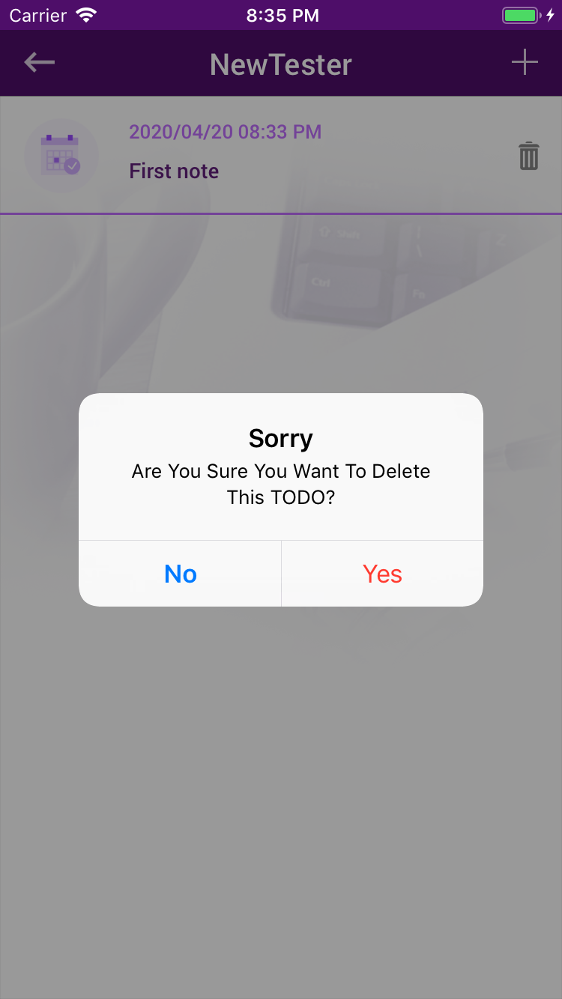

# To-Do-List
An application to track of daily obligations with date and time using google firebase database to store the
user data and the list of tasks.
It is about 4 Views.

# 1- SignUp View
It contains user name, user email and password. 
After the user submittion by using the authentication the user email and the password will be stored with auto generated ID. 
And store the user id in the firebase database 
Note: There is a Regx check of the user email and password. 
  
 

# 2- SignUp View
It contains user email and password. 
Check the Regx and the user had signed up before or not. 
  
 
  
 

# 3-User List View
It contains: 
1- Backarrow: to get back to signin view to log in with different user. 
2- Plus : to add note (Contetct with it's date and time)
  

# 4-PopUP View (note Details)
It contains: 
1- Date and time textfield by user dateAndTime Picker. 
2- content textfield to add whatever the user wants to add.
  
 
  
 
  
 

After adding the note and press save the user list view will show then the note will be added to the view and stored in the firebase database.
  
 

In case the user wants to delete any note there is a delete icon for each added note to delete it.
  
 
